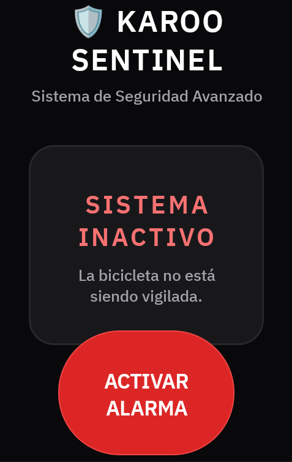
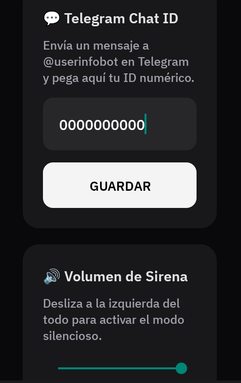
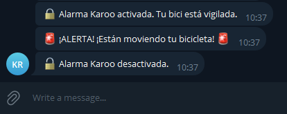

<p align="center">
  
</p>

# 🛡️ Karoo Sentinel (v0.0.6)

[🇪🇸 Español](#-español) | [🇬🇧 English](#-english)

---

## 🇪🇸 Español

**Karoo Sentinel** es una extensión de seguridad y anti-robo de código abierto desarrollada específicamente para los ciclocomputadores **Hammerhead Karoo (2 y superior)**. Utiliza los sensores integrados del dispositivo para detectar movimientos no autorizados de la bicicleta, haciendo sonar una alarma física y alertando al usuario en su teléfono a través de Telegram.

### ✨ Características Principales

<p align="center">
  
  &nbsp;&nbsp;&nbsp;&nbsp;
  
</p>

* **Detección de Movimiento Acelerométrica:** Utiliza el acelerómetro interno del Karoo para detectar la más mínima vibración o movimiento de la bicicleta cuando la alarma está armada.
* **Alerta Sonora Nativa (Hardware Beeper):** Envía patrones de pitidos de alta frecuencia directamente al "beeper" interno del dispositivo para disuadir posibles robos.
* **Notificaciones Instantáneas por Telegram:** Avisa en tiempo real directamente a tu smartphone a través de un bot de Telegram cuando se detecta movimiento.
  
  

* **Integración con SRAM AXS / Shimano Di2:** Permite armar y desarmar el sistema cómodamente desde los "Bonus Buttons" ocultos de tus manetas de cambio electrónico.
* **Interfaz de Usuario Premium:** Pantallas en modo oscuro optimizadas para la visibilidad al sol y ahorro de batería, con animaciones 3D, respuestas inmediatas sin latencia, control de volumen e indicadores de estado claros.
* **Modo "Destello de Sirena":** Al detectar intrusión, la pantalla del Karoo se enciende por encima de la pantalla de bloqueo y emite un destello pulsante de luz roja para llamar la atención.
* **Soporte Multi-Idioma (i18n):** Se adapta automáticamente al idioma del sistema del Karoo (Soporte nativo para: 🇪🇸 Español, 🇬🇧 Inglés, 🇫🇷 Francés, 🇮🇹 Italiano, 🇩🇪 Alemán, 🇵🇹 Portugués).
* **Diseño Nativo:** Icono vectorial puro y transparente integrado a la perfección con la interfaz y el launcher de Karoo (Estilo *Headwind*).

### 🚀 Cómo funciona

La aplicación funciona como un servicio persistente en segundo plano. Cuando aparcas la bici en la puerta de la cafetería:
1. Armas la alarma (desde la pantalla táctil de la App o tocando el botón de tu cambio Di2/SRAM).
2. La aplicación registrará la posición inercial exacta de la bicicleta.
3. Si alguien toca, mueve o intenta llevarse la bicicleta, los sensores detectarán una discrepancia inercial, haciendo que la pantalla parpadee en rojo, la bocina física empiece a pitar agresivamente y te llegue un mensaje a tu móvil inmediatamente.

### 📥 Instalación

Actualmente Karoo Sentinel debe instalarse en tu dispositivo mediante ADB (Android Debug Bridge), ya que aprovecha permisos de nivel de sistema y el SDK de Hammerhead.

1. Activa las **Opciones de Desarrollador** en tu Karoo (`Settings` > `About` > Toca 7 veces sobre `Build Number`).
2. Activa la **Depuración USB** (`Settings` > `Developer Options` > `USB Debugging`).
3. Conecta el Karoo a tu ordenador.
4. Descarga el último archivo `.apk` de la carpeta [releases](https://github.com/DAVOE75/KarooSentinel/tree/master/releases).
5. Abre una terminal y ejecuta el siguiente comando:
   ```bash
   adb install KarooSentinel-v0.0.6.apk
   ```

### ⚙️ Configuración y Uso

#### Configurar Notificaciones (Telegram)
Para que las alertas lleguen a tu teléfono móvil, debes vincular tu ID:
1. Abre **Telegram** en tu teléfono y busca al bot `@userinfobot`.
2. Escríbele cualquier cosa. El bot te responderá con tu número de `Id` (Ejemplo: `595159484`).
3. Abre **Karoo Sentinel** en tu ciclocomputador.
4. Escribe ese número en la casilla de configuración y pulsa **GUARDAR**.

#### Usar los botones SRAM AXS / Shimano Di2
No necesitas quitarte los guantes ni tocar la pantalla del GPS para armar la alarma al bajarte de la bici.
1. Ve a `Ajustes` (Settings) > `Sensores` (Sensors) en tu Karoo.
2. Selecciona tu grupo de cambios emparejado.
3. Busca el apartado de **Bonus Buttons** (Botones adicionales).
4. Elige si quieres configurar un toque o pulsación larga.
5. En la lista desplegable de acciones, selecciona **Alarma Anti-Robo** bajo el apartado de *Extensiones*.
6. ¡Listo! Pulsar ese botón armará/desarmará el sistema emitiendo un pitido de confirmación.

---

## 🇬🇧 English

**Karoo Sentinel** is an open-source security and anti-theft extension developed specifically for **Hammerhead Karoo (2 and above)** cycling computers. It uses the device's built-in sensors to detect unauthorized movement of the bicycle, sounding a physical alarm and alerting the user on their phone via Telegram.

### ✨ Key Features

<p align="center">
  
  &nbsp;&nbsp;&nbsp;&nbsp;
  
</p>

* **Accelerometer Motion Detection:** Uses the Karoo's internal accelerometer to detect the slightest vibration or movement of the bike when the alarm is armed.
* **Native Sound Alert (Hardware Beeper):** Sends high-frequency beep patterns directly to the device's internal "beeper" to deter potential theft.
* **Instant Telegram Notifications:** Alerts you in real-time directly to your smartphone via a Telegram bot when movement is detected.
  
  

* **SRAM AXS / Shimano Di2 Integration:** Allows you to arm and disarm the system conveniently from the hidden "Bonus Buttons" on your electronic shifters.
* **Premium User Interface:** Dark mode screens optimized for sunlight visibility and battery saving, featuring 3D animations, zero-latency responses, volume control, and clear status indicators.
* **"Siren Flash" Mode:** Upon detecting an intrusion, the Karoo screen wakes up over the lock screen and emits a pulsating red flash to draw attention.
* **Multi-Language Support (i18n):** Automatically adapts to the Karoo's system language (Native support for: 🇪🇸 Spanish, 🇬🇧 English, 🇫🇷 French, 🇮🇹 Italian, 🇩🇪 German, 🇵🇹 Portuguese).
* **Native Design:** Clean, transparent vector icon that perfectly blends with the Karoo interface and launcher (*Headwind* style).

### 🚀 How it works

The app runs as a persistent background service. When you park your bike outside a coffee shop:
1. You arm the alarm (from the App's touch screen or by clicking your Di2/SRAM button).
2. The app will record the exact inertial position of the bicycle.
3. If someone touches, moves, or tries to take the bike, the sensors will detect an inertial discrepancy, causing the screen to flash red, the physical horn to start beeping aggressively, and an immediate message to be sent to your phone.

### 📥 Installation

Currently, Karoo Sentinel must be installed on your device via ADB (Android Debug Bridge), as it leverages system-level permissions and the Hammerhead SDK.

1. Enable **Developer Options** on your Karoo (`Settings` > `About` > Tap 7 times on `Build Number`).
2. Enable **USB Debugging** (`Settings` > `Developer Options` > `USB Debugging`).
3. Connect the Karoo to your computer.
4. Download the latest `.apk` file from the [releases folder](https://github.com/DAVOE75/KarooSentinel/tree/master/releases).
5. Open a terminal and run the following command:
   ```bash
   adb install KarooSentinel-v0.0.6.apk
   ```

### ⚙️ Setup and Usage

#### Setup Notifications (Telegram)
For alerts to reach your mobile phone, you must link your ID:
1. Open **Telegram** on your phone and search for the `@userinfobot` bot.
2. Send it any message. The bot will reply with your `Id` number (Example: `595159484`).
3. Open **Karoo Sentinel** on your cycling computer.
4. Type that number into the settings box and tap **SAVE**.

#### Using SRAM AXS / Shimano Di2 buttons
You don't need to take off your gloves or touch the GPS screen to arm the alarm when you get off the bike.
1. Go to `Settings` > `Sensors` on your Karoo.
2. Select your paired shifting groupset.
3. Look for the **Bonus Buttons** section.
4. Choose whether you want to configure a single press or a long press.
5. In the actions dropdown list, select **Anti-Theft Alarm** under the *Extensions* section.
6. Done! Pressing that button will now arm/disarm the system, emitting a confirmation beep.

---

## 🛠️ Technologies / Tecnologías

* **Kotlin** (Main language).
* **Hammerhead Karoo SDK** (For native hardware control and Bonus Actions mapping).
* **Coroutines** (For asynchronous sensor management, network requests, and long-running alarms).
* **Telegram Bot API** (For asynchronous push alerts).

---

## ☕ Apoya el Proyecto / Support the Project

Si esta extensión te ha salvado la bici o simplemente te gusta mi trabajo, ¡puedes invitarme a un café para apoyar futuras actualizaciones!
*If this extension has saved your bike or you simply like my work, you can buy me a coffee to support future updates!*

<p align="center">
  <a href="https://www.buymeacoffee.com/davoe75" target="_blank">
    
  </a>
</p>

---
*Desarrollado para la comunidad ciclista.* 🚴‍♂️💨
*Developed for the cycling community.*
